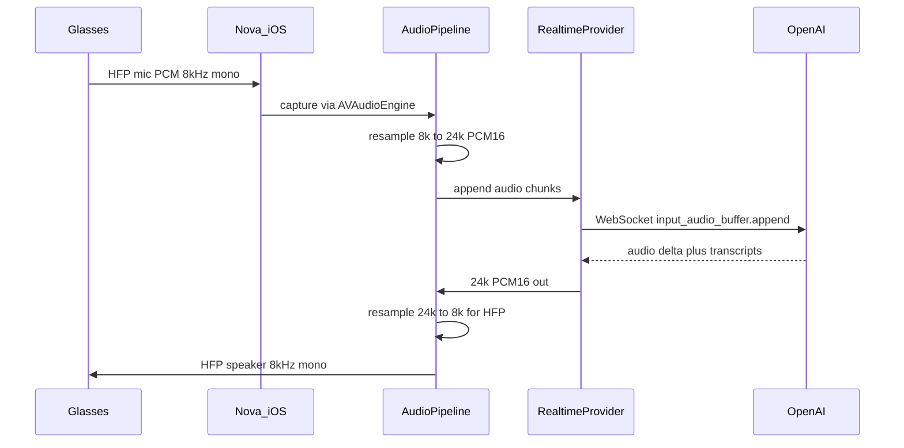
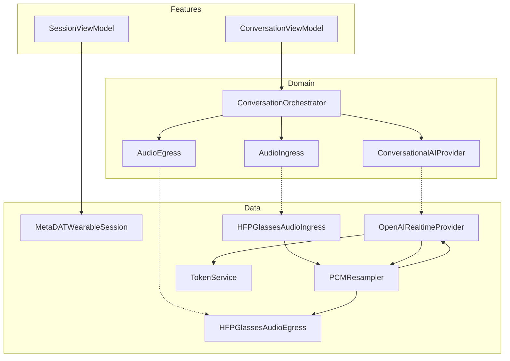
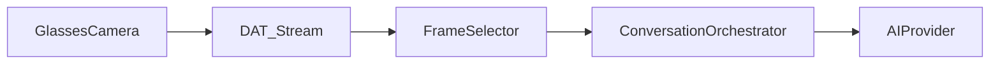

# Voice pipeline architecture

## Sequence (duplex conversation)

```mermaid
sequenceDiagram
  participant Glasses
  participant iOS as Nova_iOS
  participant Audio as AudioPipeline
  participant AI as RealtimeProvider
  participant OpenAI

  Glasses->>iOS: HFP mic PCM 8kHz mono
  iOS->>Audio: capture via AVAudioEngine
  Audio->>Audio: resample 8k to 24k PCM16
  Audio->>AI: append audio chunks
  AI->>OpenAI: WebSocket input_audio_buffer.append
  OpenAI-->>AI: audio delta plus transcripts
  AI->>Audio: 24k PCM16 out
  Audio->>Audio: resample 24k to 8k for HFP
  Audio->>Glasses: HFP speaker 8kHz mono
```

## Component flow

```mermaid
flowchart TB
  subgraph features [Features]
    SessionVM[SessionViewModel]
    ConvVM[ConversationViewModel]
  end
  subgraph domain [Domain]
    Orch[ConversationOrchestrator]
    AIPort[ConversationalAIProvider]
    Ingress[AudioIngress]
    Egress[AudioEgress]
  end
  subgraph data [Data]
    DAT[MetaDATWearableSession]
    HFPIn[HFPGlassesAudioIngress]
    HFPOut[HFPGlassesAudioEgress]
    Resample[PCMResampler]
    OAI[OpenAIRealtimeProvider]
    Tokens[TokenService]
  end
  SessionVM --> DAT
  ConvVM --> Orch
  Orch --> AIPort
  Orch --> Ingress
  Orch --> Egress
  AIPort -.-> OAI
  Ingress -.-> HFPIn
  Egress -.-> HFPOut
  HFPIn --> Resample
  Resample --> OAI
  OAI --> Resample
  Resample --> HFPOut
  OAI --> Tokens
```

## Vision path (Phase 2)

```mermaid
flowchart LR
  Cam[GlassesCamera] --> Stream[DAT_Stream]
  Stream --> Select[FrameSelector]
  Select --> Orch[ConversationOrchestrator]
  Orch --> AI[AIProvider]
```

Default: one still or short burst on visual intent. Audio always wins bandwidth.
