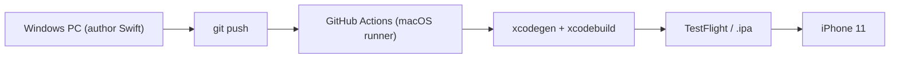

# Shipping Nova to an iPhone without owning a Mac

Target device: iPhone 11 (supports iOS 17+, so the package's `.iOS(.v17)` floor is fine).
Build machine: GitHub Actions macOS runners. Dev machine: this Windows PC.

## The pipeline

No Xcode project is committed. `Nova/project.yml` (XcodeGen) generates `NovaApp.xcodeproj`
on the runner, so the app target is authored entirely from Windows.

## Stage 1 — Compile + test (free, no accounts)

`.github/workflows/ci.yml` already does this on every push:
- Builds every Swift module for the iOS Simulator (validates the ports that can't
  build on Windows).
- Runs the package tests on a simulator.
- Generates the app project and builds `NovaApp` unsigned.

This is the immediate win: it turns the "unverifiable on Windows" Swift into
green/red CI signal.

## Stage 2 — Install on the iPhone 11 (needs signing)

Two routes. Pick based on budget vs. convenience.

### Route A — Apple Developer Program + TestFlight (recommended)
- Cost: 99 USD/year.
- CI signs the build and uploads to TestFlight via the App Store Connect API key
  (stored as GitHub secrets); you install through the TestFlight app on the phone.
- Builds last 90 days; no cables, no Mac, fully remote.
- Requires adding a signing workflow with these secrets:
  `APP_STORE_CONNECT_KEY_ID`, `APP_STORE_CONNECT_ISSUER_ID`,
  `APP_STORE_CONNECT_KEY` (p8), plus a distribution cert + provisioning profile
  (or use `fastlane match`).

### Route B — AltStore (free, fiddly)
- Cost: 0 (free Apple ID "Personal Team" provisioning).
- CI produces an unsigned/dev `.ipa` artifact; AltStore on Windows (needs iTunes +
  iCloud from Apple, not the Microsoft Store versions) signs and installs it.
- Free provisioning expires every 7 days and is limited to 3 apps; AltStore
  refreshes automatically while your PC and phone are on the same network.

## Stage 3 — The glasses (separate from the Mac question)

- Enroll in the Meta developer program (free) and enable Developer Mode on the
  glasses via the Meta AI app.
- Add the Meta Wearables Device Access Toolkit iOS SPM packages to `project.yml`
  and `Package.swift`, then implement the real `MetaDATWearableSession` /
  camera / HFP adapters behind the ports we already defined.
- Until then, `AppContainer(useFakeAI:useSilentMic:)` and `MetaDATWearableSession(useMock: true)`
  keep the app runnable.

## First-push checklist
1. Create an empty GitHub repo.
2. `git remote add origin <url>` and push `main`.
3. Watch the Actions tab; iterate on scheme/simulator names if the first run flags them.
4. Decide Route A vs B for on-device install; wire the signing workflow.
