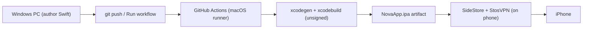

# Shipping Nova to an iPhone without owning a Mac

Target device: iPhone 11 (supports iOS 17+, so the package's `.iOS(.v17)` floor is fine).
Build machine: GitHub Actions macOS runners. Dev machine: this Windows PC.
Chosen install route: **SideStore** (free, no AltServer, no Apple Developer Program).
AltStore still works as a fallback if you prefer a PC-hosted refresh path.

## The pipeline



No Xcode project is committed. `Nova/project.yml` (XcodeGen) generates `NovaApp.xcodeproj`
on the runner, so the app target is authored entirely from Windows.

## Stage 1 — Compile + test (free, every push)

`.github/workflows/ci.yml` runs on every push:
- Builds every Swift module for the iOS Simulator (validates the ports that can't
  build on Windows).
- Runs the package tests on a simulator.
- Generates the app project and builds `NovaApp` unsigned for the simulator.

This turns the "unverifiable on Windows" Swift into green/red CI signal.

## Stage 2 — Produce an installable `.ipa` (free, on demand)

The same workflow builds an **unsigned device (arm64) `.ipa`** and uploads it as a
build artifact — but only when you ask, to save macOS minutes:

- **Manual:** GitHub → repo → **Actions** → **CI** → **Run workflow** (button).
- **Or** push a version tag: `git tag v0.1.0 && git push origin v0.1.0`.

When that run finishes, open it and download the **`NovaApp-unsigned-ipa`** artifact
(a zip containing `NovaApp.ipa`). SideStore re-signs it at install time, so it does
not need to be signed here.

Or from this PC (after `gh auth login`):

```powershell
cd Nova
.\scripts\run-ipa-ci.ps1
```

That dispatches the IPA job, waits, and writes `Nova/App/NovaApp.ipa`.

> Why gated: on a **private** repo, macOS runner minutes bill at **10x**, so the
> free 2,000 min/month is effectively ~200 macOS minutes. Making the repo **public**
> gives unlimited free Actions minutes if you'd rather build the `.ipa` on every push.

## Stage 3 — Install with SideStore

One-time setup (phone + Windows):
1. Install **iloader** on the PC and **SideStore** + **StosVPN** (LocalDevVPN) on the
   phone per [docs.sidestore.io](https://docs.sidestore.io).
2. Install Apple's **Apple Devices** app (or classic iTunes from apple.com — **not**
   the Microsoft Store build) so USB pairing works.
3. Plug the iPhone in via USB, unlock it, tap **Trust**, then use iloader to place the
   **pairing file** into SideStore.
4. On the phone: connect Wi‑Fi, open **StosVPN** until it shows Connected, then open
   SideStore and sign in with a free Apple ID.
5. **Settings → General → VPN & Device Management** → trust the Apple ID developer
   profile when prompted.

Install/refresh Nova:
6. Get a fresh `NovaApp.ipa` onto the phone (AirDrop, Files, shared folder, etc.).
7. SideStore → **My Apps** → **+** → pick `NovaApp.ipa`.
8. Keep **StosVPN Connected** whenever you refresh or install. SideStore does **not**
   need a PC server running — but it **does** need Wi‑Fi + StosVPN + a healthy pairing
   file.

### Hardening: UDID / pairing after a router reboot

**Yes, a router restart is related.** SideStore reads the device UDID through
minimuxer over the StosVPN tunnel using the pairing file. After Wi‑Fi comes back:

- StosVPN is often disconnected or on a stale Device IP
- the pairing file can look fine but still time out (`OperationError 1006`)

Quick recovery (try in order):

1. Unlock phone → same Wi‑Fi as before → **StosVPN disconnect/reconnect**.
2. SideStore → Settings → **VPN Configuration** → Device IP must match StosVPN
   (commonly `10.7.0.1`).
3. If this PC is on **NordVPN / Tailscale / similar**, disconnect it (or allow local
   LAN) while repairing — those tunnels often break SideStore's local path after a
   router reboot.
4. **Reboot the iPhone**, then Wi‑Fi + StosVPN Connected → Refresh.
5. If still failing, replace the pairing file (USB preferred):

```powershell
cd Nova
.\scripts\repair-sidestore.ps1
```

That script prints PC diagnostics (Apple Mobile Device service, iloader presence)
and the official SideStore **1006** checklist: Reset Pairing File → iloader Delete
Stored Pairing → re-pair → Place in All Apps → Refresh. Docs:
[error 1006](https://docs.sidestore.io/docs/troubleshooting/error-codes) and
[pairing file](https://docs.sidestore.io/docs/advanced/pairing-file).

## Free-provisioning limits (read before relying on this)

Free Apple ID "Personal Team" signing is real but restricted:
- **7-day expiry.** Apps stop launching after 7 days unless SideStore re-signs them
  (needs Wi‑Fi + StosVPN + a working pairing file).
- **3 sideloaded apps** installed at once; **10 App IDs / 7 days**.
- **Limited entitlements.** Free provisioning grants only a small set of capabilities.

### What this means for the Meta glasses
- **Standard Bluetooth LE (CoreBluetooth)** and **Bluetooth audio (HFP)** do **not**
  need a special entitlement, so the current audio path should work under SideStore.
- **MFi / External Accessory** protocols and some background/accessory entitlements are
  **not** available to free accounts. If the Meta Wearables Device Access Toolkit turns
  out to require an MFi/External-Accessory entitlement, sideloading will hit a
  wall and the Apple Developer Program ($99/yr) becomes necessary for on-device glasses
  use. Standard-BLE / audio-route features are unaffected.

Verify this early: install the app via SideStore and confirm the glasses connect over
the standard audio route before investing further in the free path.

## Stage 4 — The glasses camera (wired)

The Meta Wearables Device Access Toolkit (`github.com/facebook/meta-wearables-dat-ios`,
0.8.0) is now integrated:

- `Package.swift` pulls `MWDATCore` + `MWDATCamera` into `NovaData`.
- `MetaDATFrameCapture` (behind `#if canImport(MWDATCamera)`) opens a low-FPS glasses
  stream and returns real stills via `capturePhoto` → `photoDataPublisher`. Off the SDK
  (non-iOS builds) it falls back to a placeholder frame so the vision path still runs.
- `project.yml` adds the SPM package to the app target and the required `Info.plist`
  keys (`UISupportedExternalAccessoryProtocols` = `com.meta.ar.wearable`, background
  modes, the `nova://` URL scheme, `fb-viewapp` query scheme, and the `MWDAT` dict).
- `NovaApp` calls `Wearables.configure()` at launch and routes callbacks to
  `Wearables.shared.handleUrl(_:)`.

Registration is wired too: `MetaDATWearableSession(useMock: false)` calls
`Wearables.shared.startRegistration()` and mirrors `registrationStateStream()` into
the session UI. The Register button in the app drives it.

### Runtime prerequisites (device only — CI just compiles this)

1. In `NovaApp`, construct the container with all three flags `false`:
   `AppContainer(useFakeAI: false, useSilentMic: false, useMockGlasses: false)`.
2. Install the Meta AI companion app and enable **Developer Mode**
   (Settings → your glasses → Developer Mode).
3. Tap **Register** — Nova deep-links to Meta AI to approve the app, then grant
   **camera** permission on the first "Nova, what's this?".
4. `MetaAppID` is `0` for Developer Mode; set a real Meta App ID for release.

When you say **"Nova, what's this?"**, the orchestrator calls `captureStill()`, which
requests camera permission, starts a glasses `DeviceSession` + `Stream`, captures a JPEG,
and hands it to the Realtime model.

## Stage 5 — Realtime credentials (OpenAI key)

For a private, single-user build there's no separate token backend:
`DirectOpenAITokenService` mints a short-lived ephemeral secret
(`POST /v1/realtime/client_secrets`) directly from OpenAI using your standard key, and
only that `ek_...` secret is used for the WebSocket. The key is resolved from, in order:

1. `NOVA_OPENAI_API_KEY` / `OPENAI_API_KEY` environment (Simulator / dev).
2. The app's `OpenAIAPIKey` Info.plist value, fed from `OPENAI_API_KEY` in a build
   config.

To supply the key for a device build:

```
cp Nova/Config/Secrets.example.xcconfig Nova/Config/Secrets.xcconfig
# edit Secrets.xcconfig → OPENAI_API_KEY = sk-...
```

`Config/Secrets.xcconfig` is git-ignored and optionally included by the committed
`Config/Nova.xcconfig`. If no key is present the app falls back to `StubTokenService`
(the `NOVA_OPENAI_STUB_TOKEN` path). CI never has a key, so it compiles the path without
using it.

> This bakes the standard key into the app bundle in plain text — fine for a private
> sideloaded build, not for public distribution. For that, stand up a token backend and
> point `HTTPTokenService` at it instead.

## Fallback route — Apple Developer Program + TestFlight

If free provisioning proves too limiting (entitlements or the 7-day churn):
- Cost: 99 USD/year.
- CI signs the build and uploads to TestFlight via an App Store Connect API key stored
  as GitHub secrets (`APP_STORE_CONNECT_KEY_ID`, `APP_STORE_CONNECT_ISSUER_ID`,
  `APP_STORE_CONNECT_KEY`); you install through the TestFlight app.
- Builds last 90 days, no cables, no Mac, fully remote.
